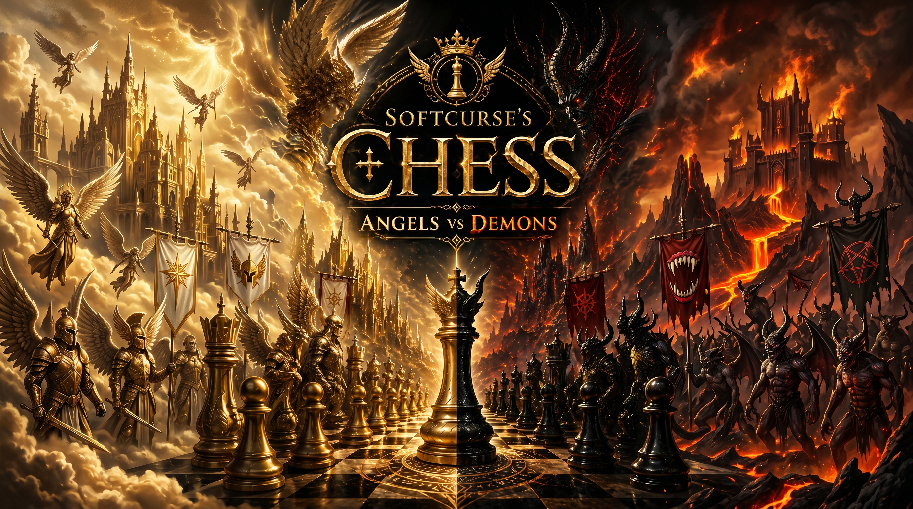

  

  # Softcurse's Chess
  
  **An epic, high-fidelity 3D chess engine blurring the line between Heavens and Underworld.**

  [Official Website](https://softcurse-website.pages.dev/)

---

## 🏔 The Game

**Softcurse's Chess** is a fully standalone, cinematic chess experience designed to push modern browser graphics APIs to their limits. Through a masterfully crafted procedural terrain separating Angelic forces and Demonic legions, we leverage raw shader logic and geometry definitions directly within the client bounds to assemble a breathtaking, high-fidelity PBR environment that plays beautifully on modern desktop systems.

Whether you're a tactician exploring the asymmetric local Minimax structure, a casual player enjoying the orbital UI, or simply a chess fanatic looking for a spectacular fight against our sophisticated AI, **Softcurse's Chess** stands as a definitive cinematic chess laboratory.

---

## ✨ Features

- **PBR Render Physics:** Fully baked PBR texture integration driving obsidian glass shading, pearlescent marbles, and magma emissions.
- **Cinematic Workflow Operations:** Fully animated splash screens, orbital menu loops, procedural `burst` meshes on capture, and logic-locked orbital cameras.
- **Battle AI Implementation:** Asymmetric local AI models featuring adaptive difficulty states (from Recruit to Grandmaster) processing directly on the client.
- **Seamless Integrations:** Features dynamic language loading architectures ensuring your experience translates seamlessly to English, Russian, and Georgian globally.
- **Procedural Audio Engine:** Dynamic WebAudio frequency synthesis computing unique sonic envelopes during moves, checks, and physical mesh clashes.

---

## 🏗 About The Architect

### Softcurse Systems

**Forged in shadow. Engineered for control. Built for the future.**

Softcurse Systems is not merely a software label. It is a growing digital infrastructure forged to create powerful systems, premium software ecosystems, and performance-driven platforms that merge technical precision with visionary design.

Where most brands build tools, Softcurse builds fortified environments.

---

#### Core Purpose

Softcurse Systems specializes in the creation of:

* Advanced software architecture
* High-performance web systems
* Secure administrative infrastructure
* API and credential management environments
* Premium digital branding ecosystems
* Scalable deployment solutions

Every project is designed with a singular philosophy:

**Power. Stability. Precision.**

---

#### Design Philosophy

Softcurse embraces a dark-futuristic identity where software is treated as engineered infrastructure rather than disposable products.

**Principles:**
* Performance-first engineering
* Secure system architecture
* Elegant control interfaces
* Enterprise-grade aesthetics
* Scalable innovation
* Relentless optimization

This is software crafted not for noise, but for dominance.

---

#### Vision

Softcurse Systems aims to become a unified technological ecosystem capable of delivering:

* Backend frameworks
* Developer management tools
* Secure cloud-connected systems
* Interactive software platforms
* Branded digital experiences

From web architecture to software control vaults, every system is designed to operate with precision and authority.

---

#### The Softcurse Standard

Softcurse software is built around:

* Stability under pressure
* Efficient resource management
* Modern deployment strategies
* Secure operational frameworks
* Sophisticated user experience

In simpler terms:

**Elegant systems. Brutal efficiency.**

---

#### Beyond Development (Softcurse Studios)

Softcurse is not confined to software alone. Under the **Softcurse Studios** banner, it represents a broader creative and technological force focused on:

* Game development
* Software products
* Infrastructure solutions
* Brand identity
* Digital innovation

Each creation serves as part of an expanding ecosystem engineered to leave an unmistakable mark.

---

#### Statement

**Softcurse Systems** exists for those who demand more than ordinary software.

For creators.
For builders.
For architects of powerful digital worlds.

---

**Architecting the future through shadow, precision, and uncompromising innovation.**

🌐 [Softcurse Systems Official Website](https://softcurse-website.pages.dev/)