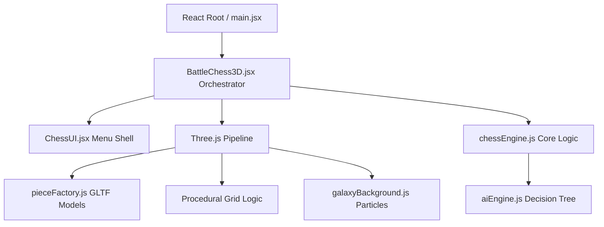

<div align="center">
  

  # Softcurse's Chess

  **An epic, high-fidelity 3D chess engine blurring the line between Heavens and Underworld.**

  [](https://github.com/Beardicuss/Softcurse-Chess/actions)
  [](https://opensource.org/licenses/MIT)
  [](https://vitejs.dev/)
  [](https://threejs.org/)
  [](https://reactjs.org/)

</div>

---

## 📖 Table of Contents
- [Overview](#-overview)
- [✨ Features](#-features)
- [📦 Installation](#-installation)
- [🚀 Quick Start](#-quick-start)
- [🔧 Configuration](#-configuration)
- [🏗️ Architecture](#️-architecture)
- [🧪 Testing](#-testing)
- [🤝 Contributing](#-contributing)
- [🛣️ Roadmap](#️-roadmap)
- [📄 License](#-license)
- [👥 Acknowledgements](#-acknowledgements)
- [💬 Support](#-support)

---

## 🏔 Overview

**Softcurse's Chess**  is a purely web-based, cinematic chess experience designed to push modern browser graphics APIs to their limits. Through a masterfully crafted procedural terrain separating Angelic forces and Demonic legions, we leverage `Three.js` directly within `React` state boundaries to assemble a breathtaking, high-fidelity PBR environment that plays beautifully on modern desktops.

Whether you're a framework engineer exploring complex state orchestration with `React Fiber` parallels, a technical artist interested in PMREM volumetric global illumination maps and WebGL overlays, or simply a chess fanatic looking for a spectacular fight against an embedded AI, **Softcurse's Chess** is the definitive open-source cinematic chess laboratory.

---

## ✨ Features

- **PBR Render Physics:** Fully baked PBR texture integration driving obsidian glass shading, pearlescent marbles, and magma emissions.
- **Cinematic Workflow Operations:** Fully animated splash screens, orbital menu loops, procedural `burst` meshes on capture, and logic-locked orbital cameras.
- **Battle AI Implementation:** Asymmetric local Minimax/Alpha-Beta search algorithms processing local graph nodes directly adjacent to UI component layouts.
- **Intelligent Serialization:** LocalStorage based cache indexing securing ongoing matches securely through the `AI Save Memory`.
- **Procedural Audio Engine:** Dynamic WebAudio frequency synthesis computing unique sonic envelopes during moves, checks, and physical mesh clashes.

---

## 📦 Installation

To play, experiment, or build directly with the source code, utilize Node.js and the Vite bundler architecture.

### Prerequisites
- Node.js (v18.x or newer recommended)
- `npm` or `yarn` installed natively on your environment

### Setup

```bash
# 1. Clone the repository 
git clone https://github.com/Beardicuss/Softcurse-Chess.git

# 2. Drop into the directory 
cd Softcurse-Chess

# 3. Pull all package dependencies 
npm install
```

---

## 🚀 Quick Start

To spin up a local development instance of the renderer:

```bash
# Deploys a live Vite HMR streaming server
npm run dev
```
> The terminal will display your localhost port (typically `http://localhost:5173`). Simply navigate to this URI in a modern WebGL-accelerated browser!

To package a minified production deployment chunk folder (`dist/`):
```bash
npm run build
```

---

## 🔧 Configuration

While **Softcurse's Chess** avoids cumbersome dotfile configurations in favor of functional immutability, visual parameters sit neatly tucked inside pure constant maps.

Inside `/src/constants.js`:
```javascript
export const THEME = {
    bg: 0x0a0a0c,              // The absolute Void backdrop
    fogDensity: 0.018,         // Volumetric fog absorption limits
    boardBase: 0x111111,       // Raw baseline albedo limits 
    whiteAccent: 0x00ffff,     // Cyan bursts for Heaven captures
    blackAccent: 0xff00aa      // Magenta neon for Hell executions
};
```
Change these directly to dramatically morph the structural aesthetic of the battlefield. 

---

## 🏗️ Architecture



### Key Subsystems:
- **`BattleChess3D.jsx`:** The core master orchestrator maintaining coordinate bridges between React memory refs and ThreeJS raw geometry graphs.
- **`chessEngine.js`:** Pure functional dependency mapping game rules, threefold repetitions, un-do states, and legal movement offsets.
- **`pieceFactory.js`:** GLTFLoader encapsulation caching the intensive 3MF/GLB polygon models on application boot.

---

## 🧪 Testing

Given that much of the code is strictly tied into graphical bounds rendering limits, manual integration testing remains our priority standard protocol path. Check back post v1.8 for standard unit implementations mapped against the `chessEngine` discrete logical bounds.

---

## 🤝 Contributing

We welcome the entire developer community! Whether it's adding a new lighting mechanism, increasing the performance bounds of the `aiEngine`, or patching an obscure WebGL fallback, your PRs are celebrated.

Read our [Contributing Guide](.github/CONTRIBUTING.md) to understand branch structures and the conventional commit framework used. Don't forget to review our [Code of Conduct](.github/CODE_OF_CONDUCT.md).

---

## 🛣️ Roadmap

- [ ] **Multiplayer Architecture:** WebRTC or custom WebSocket signaling servers permitting P2P matchmaking securely over standard proxy.
- [ ] **Enhanced AI Engine:** WebWorker offloading of minimax calculation to eliminate main-thread stalling during `COMMANDER` difficulty.
- [ ] **Castling Shaders:** Expanding custom collision particles during King/Rook Castling swaps.
- [ ] **Mobile Touch Support:** Reworking pointer interaction arrays and mesh bounding box raycast hits to accommodate thick mobile interactions smoothly.

---

## 📄 License

Distributed under the MIT License. See [LICENSE](LICENSE) for more information.

> Permits commercial application, personal modifications, and distribution inherently free of encumbrance assuming general attribution constraints intact.

---

## 👥 Acknowledgements

- **Softcurse Lab** - The sole architecture, design, and structural development base.
- **Creality Cloud Community** - Foundational geometry models heavily adapted via mesh decimation routines.
- **AmbientCG** - Incredible CC0 PBR textures defining our materials structure.

---

## 💬 Support

If you run into missing graphics, matrix crashes, or weird behaviors in the logic loop:
- Feel free to directly document findings by dropping a [Bug Report Template](https://github.com/Beardicuss/Softcurse-Chess/issues).
- Want to just chat concepts? Use GitHub Discussions natively hosted within the repository!
